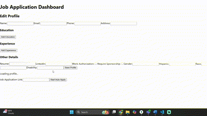

# ApplyQuick 🧠💼

ApplyQuick is a tool that helps you apply to jobs faster by auto-filling application forms from job links. It fills in the info it knows, and pauses to let you finish the rest manually.

## Features
- Paste a job link and auto-fill known fields
- Opens a browser for manual input when needed
- Saves your profile data for reuse
- Simple UI built with React
- Automation powered by Puppeteer

## Tech Stack
- Frontend: React
- Backend: Node.js + Express
- Automation: Puppeteer
- Database: MongoDB

## Getting Started

```bash
# Clone the repo
git clone https://github.com/anthonyadade/applyquick.git
cd applyquick

# Install backend
cd server
npm install
npm run dev

# Install frontend
cd ../client
npm install
npm start
```

## How It Works
1. Enter a job link into the app.
2. Puppeteer fills out what it can.
3. For anything it doesn’t recognize, it pauses and shows the form.
4. You finish and submit.

## 📸 Demo

